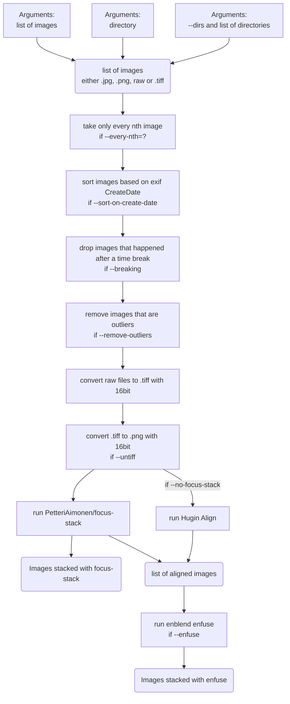

# myphoto

This is a collection of scripts, tools and workflows that I use for developping images. In large parts it focuses on stacking of extreme macro images.

## myphoto-stack
This implements a pipeline to filter, align and stack images with [PetteriAimonen/focus-stack](https://github.com/PetteriAimonen/focus-stack) and [Enblend Enfuse](https://enblend.sourceforge.net/).

## myphoto-watch
An application to watch a folder (e.g. a FTP folder, to which the camera pushes its images) and automatically run the stacking logic from above on completed stacks.